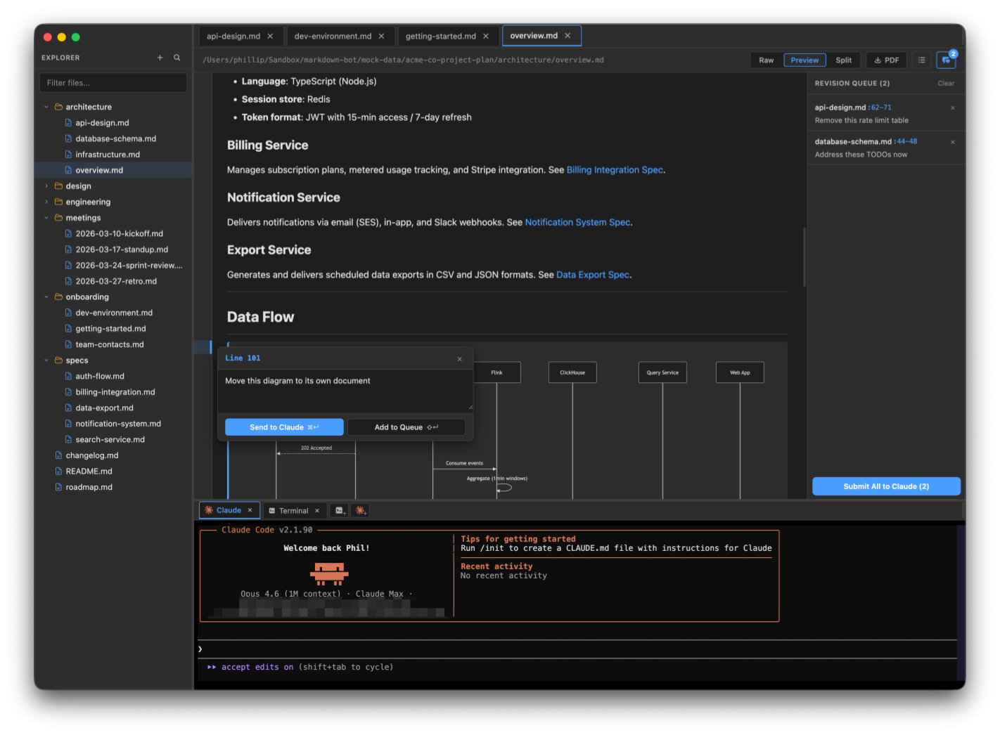

# MarkdownBot

**Markdown Editor + Claude Code**

Open any directory, browse and edit your files, highlight lines to send comments straight to Claude, and get back to writing.

Note: this was fully vibe coded — expect rough edges.



## Features

- **Claude Code Integration**
  - Highlight lines in the editor or preview gutter, attach a comment, and send it straight to a Claude Code terminal session.
  - Queue up multiple comments across files and submit them to Claude all at once as a revision batch.
  - Uses regular Claude Code CLI — works with your existing subscription, skills, plugins, agents, etc.
- **Live Preview & Split View** — See rendered markdown side-by-side as you type, with full GitHub Flavored Markdown and Mermaid diagram support.
- **Integrated Terminal** — Drop into a full terminal without leaving the app. Run Claude Code, git, or any shell command. Supports multiple terminal tabs.
- **File Tree Browser** — Open any directory and navigate your markdown files in a sidebar tree.
- **Document Outline** — A table of contents generated from your headings, always one click away.
- **CodeMirror 6 Editor** — Fast, extensible editing with syntax highlighting, autocomplete, and smart list continuation.
- **Git Diff View** — See what changed at a glance with inline diffs for modified files.
- **PDF Export** — Export any markdown document to a clean PDF.
- **Project-Wide Search** — Search across every file in your project instantly (Cmd+Shift+F), with regex support.
- **Quick Open (Cmd+P)** — Jump to any file by name without touching the mouse.
- **File Watching** — Live-reloads when files are edited on disk (by Claude Code or anything else).
- **Dark Mode** — Follows macOS system appearance.

## Getting Started

Requires [Node.js](https://nodejs.org/) v24 LTS or later.

```bash
git clone https://github.com/pb30/markdownbot.git
cd markdownbot
./run.sh          # dev mode (default)
./run.sh build    # package the app
./run.sh release  # build and install to /Applications
```